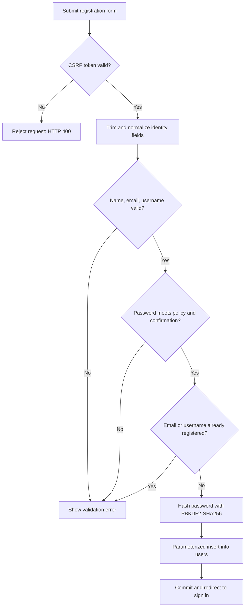
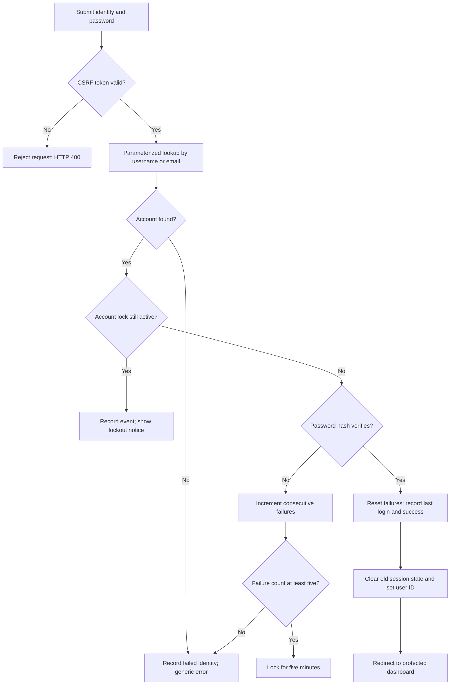
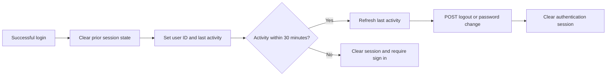

# Registration and login flowcharts

## Registration

```mermaid
flowchart TD
    A[Submit registration form] --> B{CSRF token valid?}
    B -- No --> X[Reject request: HTTP 400]
    B -- Yes --> C[Trim and normalize identity fields]
    C --> D{Name, email, username valid?}
    D -- No --> E[Show validation error]
    D -- Yes --> F{Password meets policy and confirmation?}
    F -- No --> E
    F -- Yes --> G{Email or username already registered?}
    G -- Yes --> E
    G -- No --> H[Hash password with PBKDF2-SHA256]
    H --> I[Parameterized insert into users]
    I --> J[Commit and redirect to sign in]
```

## Login

```mermaid
flowchart TD
    A[Submit identity and password] --> B{CSRF token valid?}
    B -- No --> X[Reject request: HTTP 400]
    B -- Yes --> C[Parameterized lookup by username or email]
    C --> D{Account found?}
    D -- No --> E[Record failed identity; generic error]
    D -- Yes --> F{Account lock still active?}
    F -- Yes --> G[Record event; show lockout notice]
    F -- No --> H{Password hash verifies?}
    H -- No --> I[Increment consecutive failures]
    I --> J{Failure count at least five?}
    J -- Yes --> K[Lock for five minutes]
    J -- No --> E
    H -- Yes --> L[Reset failures; record last login and success]
    L --> M[Clear old session state and set user ID]
    M --> N[Redirect to protected dashboard]
```

## Session lifecycle

```mermaid
flowchart LR
    A[Successful login] --> B[Clear prior session state]
    B --> C[Set user ID and last activity]
    C --> D{Activity within 30 minutes?}
    D -- Yes --> E[Refresh last activity]
    D -- No --> F[Clear session and require sign in]
    E --> G[POST logout or password change]
    G --> H[Clear authentication session]
```
